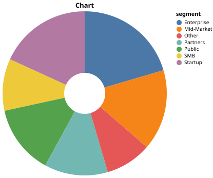
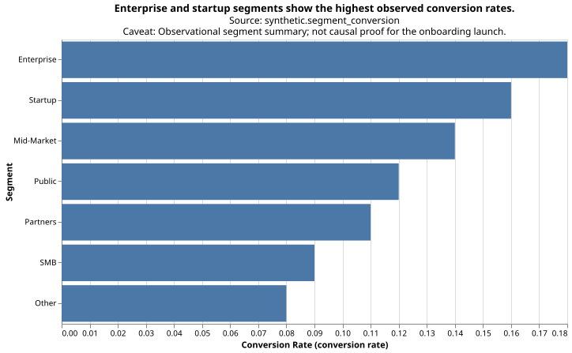

# chart-contract

A lightweight Python harness for claim-first, audited analytical charts.

Charts should satisfy analytical contracts, not just render.

`chart-contract` helps analysts and AI agents produce claim-first charts that can be audited before sharing. A chart should not just render; it should declare what it claims, what data supports it, and what could mislead the reader. Charts are reasoning artifacts, not decorations.

Stop beautiful AI charts from smuggling weak claims.

## Why This Matters

AI-generated charts can look plausible while hiding weak claims, missing units, missing sources, misleading visual forms, or causal overreach. `chart-contract` makes those assumptions explicit before the chart is shared.

The audit also catches single-point trend claims: a directional trend needs at least two observations, enforced by `data.trend.min_points`.

It is a chart-contract harness:

`claim -> data contract -> visual choice -> audit -> render`

It is intentionally not a full visualization library, not a dashboard tool, and not an AI chart generator.

## Visual Proof

| Bad chart | Corrected chart |
| --- | --- |
|  |  |

The bad chart renders, but the audit flags the weak claim, missing source, generic title, and arc/category issue.
The corrected chart switches to a sorted bar chart that is easier to compare.
It keeps the claim narrower, with source and unit metadata visible.
The caveat keeps the interpretation descriptive rather than causal.

Outputs from the hero demo:

- [Corrected Vega-Lite spec](examples/output/corrected_chart.vl.json)
- [Audit report, Markdown](examples/output/bad_chart_audit.md)
- [Audit report, JSON](examples/output/bad_chart_audit.json)
- [Bad chart SVG](examples/output/bad_chart.svg)
- [Corrected chart SVG](examples/output/corrected_chart.svg)

See [docs/AUDIT_RULES.md](docs/AUDIT_RULES.md) for the rule reference behind these findings.

The hero demo includes lightweight rendered charts alongside the audit artifacts so the first impression is inspectable without extra tooling.

## Why not just Altair, Great Expectations, or a checklist?

| Tool | What it does |
| --- | --- |
| Altair / Vega-Lite | Renders charts. |
| Great Expectations | Validates data expectations. |
| Dashboard QA checklists | Depend on humans remembering the steps. |
| `chart-contract` | Audits claim + data + visual choice + provenance before sharing. |

`chart-contract` complements these tools rather than replacing them.

## Quickstart

```bash
python -m pip install -e ".[dev]"
python examples/bad_to_good_chart.py
pytest
```

## CLI Audit Gate

Use the CLI as the front door for agent-gated chart checks:

```bash
chart-contract audit spec examples/traps/causal_claim_missing_caveat.vl.json \
  --data examples/traps/causal_claim_missing_caveat.csv \
  --claim "$(cat examples/traps/causal_claim_missing_caveat.claim.txt)"
```

Representative output:

```text
Verdict: REVIEW
Summary: PASS=5 WARN=1 FAIL=0
Findings:
- WARN claim.causal_support: Claim uses causal language without a caveat or causal evidence metadata. Suggestion: Add a caveat or spec['usermeta']['causal_evidence']=True when justified.
```

Exit behavior:

- `READY` exits `0`.
- `REVIEW` exits `0` by default and `1` when `--warnings-as-errors` is set.
- `BLOCK` exits `1`.
- `--fail-on READY|REVIEW|BLOCK` is also available for explicit thresholds; `READY` is mechanically valid but means the command will fail for any verdict.

For more agent-facing guidance on v0.2.0, see [docs/AGENT_INTEGRATION.md](docs/AGENT_INTEGRATION.md), the runnable CLI traps in [examples/traps/README.md](examples/traps/README.md), and the older Python probes in [examples/quality_traps.py](examples/quality_traps.py). `Chart.from_prompt()` is intentionally not part of the release.

## Bad Chart -> Audit -> Corrected Chart

The repo leads with a risky chart example because that is the point of the package: catch weak analytical defaults before a chart gets shared.

```python
import pandas as pd
from chart_contract import Chart, audit_spec

df = pd.DataFrame(
    {
        "segment": ["SMB", "Enterprise", "Mid-Market", "Public", "Startup", "Partners", "Other"],
        "conversion_rate": [0.09, 0.18, 0.14, 0.12, 0.16, 0.11, 0.08],
    }
)

bad_vega_lite_spec = {
    "mark": {"type": "arc", "innerRadius": 40},
    "title": "Chart",
    "encoding": {
        "theta": {"field": "conversion_rate", "type": "quantitative"},
        "color": {"field": "segment", "type": "nominal"},
    },
}

findings = audit_spec(
    spec=bad_vega_lite_spec,
    data=df,
    claim="The onboarding launch caused conversion lift across customer segments.",
)

corrected = Chart.rank(
    data=df.sort_values("conversion_rate", ascending=False),
    x="segment",
    y="conversion_rate",
    claim="Enterprise and startup segments show the highest observed conversion rates.",
    source="synthetic.segment_conversion",
    unit="conversion rate",
    caveat="Observational segment summary; not causal proof for the onboarding launch.",
)
```

Representative audit output from `python examples/bad_to_good_chart.py`:

```text
PASS contract.claim.present
WARN contract.source.present
WARN labels.title.quality
WARN claim.causal_support
FAIL visual.arc.category_count
PASS readability.color.category_count
```

Run the full hero demo with:

```bash
python examples/bad_to_good_chart.py
```

It audits the risky pie-like chart, prints PASS/WARN/FAIL findings, and writes a corrected Vega-Lite spec to [examples/output/corrected_chart.vl.json](examples/output/corrected_chart.vl.json).

## API

```python
import pandas as pd
from chart_contract import Chart

df = pd.DataFrame(
    {
        "week": ["2026-05-01", "2026-05-08", "2026-05-15"],
        "conversion_rate": [0.12, 0.14, 0.16],
    }
)

chart = Chart.trend(
    data=df,
    x="week",
    y="conversion_rate",
    claim="Conversion improved after onboarding launch",
    source="warehouse.funnel_events",
    unit="conversion rate",
    event={"x": "2026-05-08", "label": "Onboarding launch"},
    caveat="Observational trend; not causal proof.",
)

report = chart.audit()
spec = chart.to_vega_lite()
altair_chart = chart.to_altair()
```

For a minimal pre-share gate, inspect `report.verdict` before you send the chart onward: `READY` means the audit found only `PASS` checks, `REVIEW` means warnings need human judgment, and `BLOCK` means at least one failure should stop sharing until fixed. `report.verdict` is the authoritative gate field; `report.passed` only means there are no `FAIL` findings, so a `REVIEW` report can still have `passed=True`.

Supported Python API front-door intents:

- `Chart.trend()`
- `Chart.rank()`
- `Chart.compare()`
- `Chart.histogram()`
- `Chart.boxplot()`
- `Chart.violin()`
- `Chart.qq()`
- `Chart.ecdf()`
- `Chart.residual()`
- `Chart.set_membership()`
- experimental `audit_spec()`

## Scope and Non-Goals

- Not a full visualization library
- Not a dashboard tool
- Not an AI chart generator
- No automatic chart correction

## Design Principles

- Claim first
- Data contract before rendering
- Audit before sharing
- Visual integrity over decoration
- Provenance and caveats visible

The audit layer uses Tufte-inspired visual integrity checks. It does not claim to be Tufte-compliant or Tufte-certified.

## Distribution Charts

Use distribution intents when the claim is about spread, shape, outliers, or typical values rather than a trend or rank.

- Histograms are good for one metric's distribution.
- Boxplots are good for robust summaries and outliers.
- Violin plots are good for shape, but they need more observations to stay readable.

Run `python examples/distribution_charts.py` to write:

- `examples/output/histogram_chart.vl.json`
- `examples/output/boxplot_chart.vl.json`
- `examples/output/violin_chart.vl.json`

These charts stay inside the same claim-first audit flow and are not a full visualization library.

## Statistical Diagnostic Plots

Use the statistical intents when the claim is about distribution fit, cumulative shape, or model residual behavior.

- `Chart.qq()` compares observed quantiles with a fitted normal reference line. The normal reference is the only supported distribution in this slice.
- `Chart.ecdf()` shows cumulative probability without choosing histogram bins.
- `Chart.residual()` plots residuals against fitted values and always includes a zero reference line.

Run `python examples/statistical_diagnostics.py` to write QQ, ECDF, and residual Vega-Lite specs into `examples/output/`.

These diagnostics audit data and rendering contracts; they do not certify normality or model adequacy. See [diagnostic claim guidance](docs/DIAGNOSTIC_CLAIMS.md) for agent-ready wording patterns.

### Diagnostic claim guidance

Diagnostic claims are often absence claims, so they should be narrower than ordinary descriptive claims.

- Weak QQ claim: “The data are normal.”
- Stronger QQ claim: “Observed quantiles broadly track the fitted normal reference through the center, while the outer tails depart from the line.”
- Weak residual claim: “There is no pattern in the residuals.”
- Stronger residual claim: “Residuals remain centered near zero across the observed fitted-value range, with no large monotonic or curved structure at the audit thresholds.”

Good diagnostic claims:

- describe observed alignment or departure rather than certify a distribution or model;
- name tail, trend, curvature, tie, crossing, or sample-size limitations;
- keep the required fitted or zero reference line visible;
- use wording such as “broadly consistent,” “appears,” or “within the observed range” when the evidence is visual and finite.

### Try the diagnostic traps

The runnable fixtures in [examples/traps/README.md](examples/traps/README.md) make the diagnostic boundaries concrete.

## Set Membership Charts

Use `Chart.set_membership()` when the claim is about exactly two sets: overlap, exclusion, subset relationships, or coverage of a declared universe.

The input is one row per member plus two explicit boolean or `0`/`1` membership columns. The audit blocks missing columns, non-binary membership, null identifiers, and duplicated members before region counts are rendered.

```python
frame = pd.DataFrame(
    {
        "customer_id": ["c1", "c2", "c3", "c4"],
        "email": [1, 1, 0, 0],
        "paid_search": [0, 1, 1, 0],
    }
)

chart = Chart.set_membership(
    data=frame,
    member="customer_id",
    set_a="email",
    set_b="paid_search",
    set_a_label="Email",
    set_b_label="Paid search",
    claim="Email and paid search overlap for one of four customers.",
    source="warehouse.channel_reach",
    title="Customer reach overlap by channel",
)
```

The renderer supports partial overlap, disjoint, subset, and equal-set relationships. Circle geometry is schematic; labeled A-only, overlap, B-only, and neither counts are authoritative and are preserved in `usermeta`.

Run `python examples/set_membership.py` to write `examples/output/set_membership_chart.vl.json`. See [the set membership contract](docs/SET_MEMBERSHIP.md) for the evidence shape, audit rules, and intentional two-set boundary.
